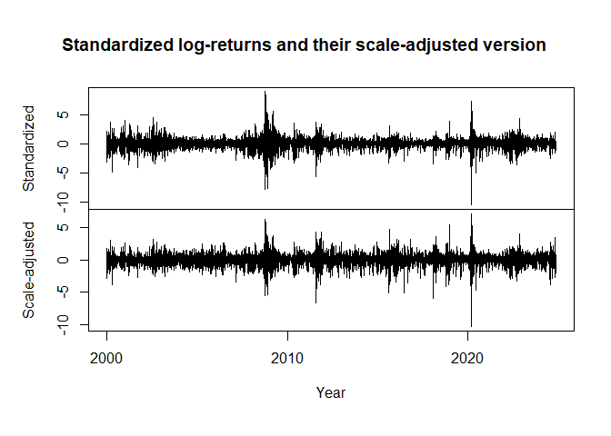
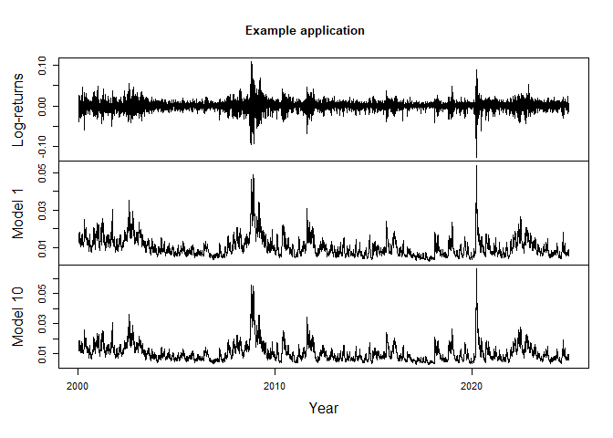
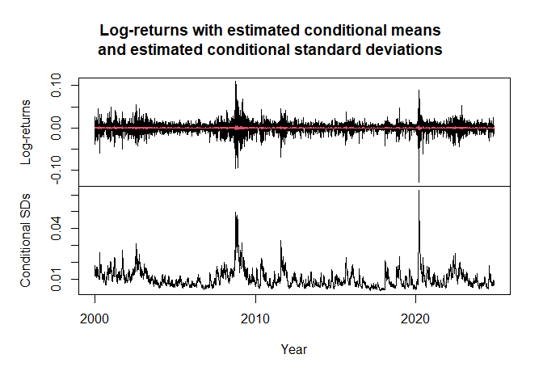
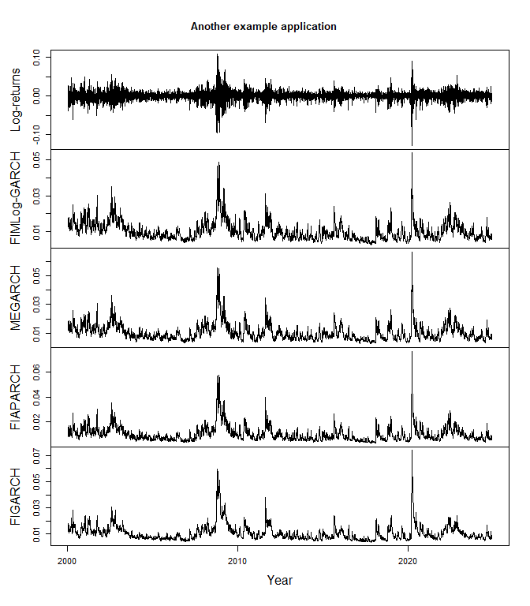
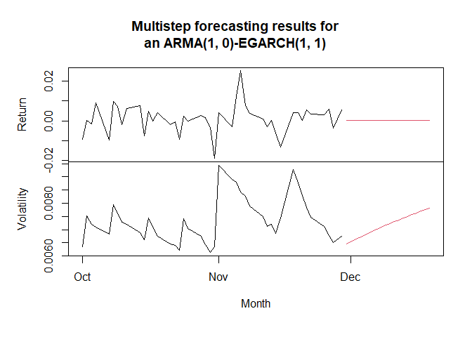
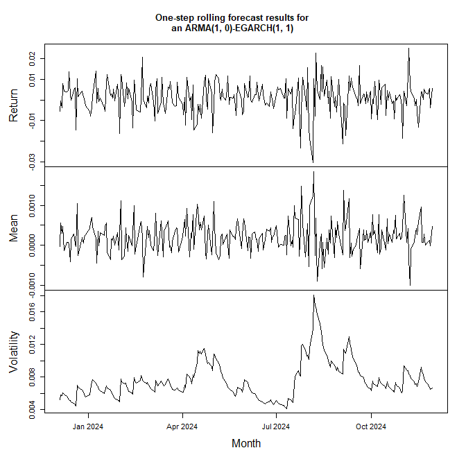
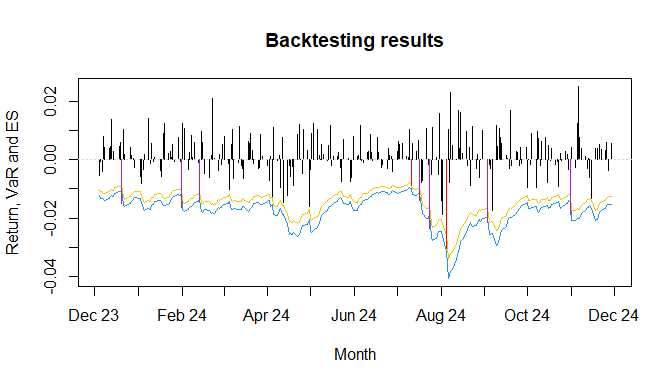
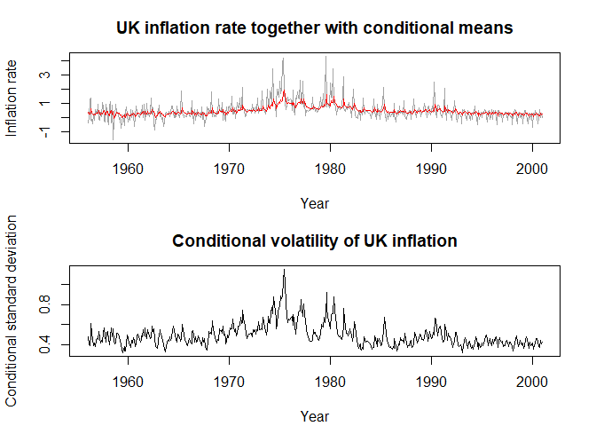

<!-- README.md is generated from README.Rmd. Please edit that file -->

# fEGarch 

<!-- badges: start -->

[](https://cran.r-project.org/package=fEGarch)
[](https://cran.r-project.org/package=fEGarch)
[](https://cran.r-project.org/package=fEGarch)
[](https://cran.r-project.org/web/licenses/GPL-3)
<!-- badges: end -->

The goal of `fEGarch` is to provide easy access to a broad family of
exponential generalized autoregressive conditional heteroskedasticity
(EGARCH) models both with either short or long memory. The six most
common conditional distributions, i.e. a normal distribution, a
t-distribution, a generalized error distribution, and the skewed
variants of those three, are available. Furthermore, we introduce the
average Laplace distribution and its skewed variant as newly selectable
conditional distributions. Overall, the EGARCH family models are a
strong competition to well-established GARCH-type models and provide new
ways to estimate conditional volatilities, while making the prominent
EGARCH and fractionally integrated EGARCH (FIEGARCH) available as
special cases. For convenience and the purpose of comparison,
fractionally integrated asymmetric power ARCH (FIAPARCH), fractionally
integrated Glosten-Jagannathan-Runkle GARCH (FIGJR-GARCH), fractionally
integrated threshold GARCH (FITGARCH) and fractionally integrated GARCH
(FIGARCH) models are available as well as their short-memory variants
(APARCH, GJR-GARCH, TGARCH, GARCH). Throughout, the estimation method is
quasi-maximum-likelihood estimation (conditioned on presample values).

## Installation

You can install the current version of the package from CRAN with:

``` r
install.packages("fEGarch")
```

## Examples

### Basic applications

This is a basic example which shows you how to fit a model of the EGARCH
family to the Standard and Poor’s 500 daily log-returns.

At first, specify a model from the EGARCH family using `fEGarch_spec()`.

``` r
library(fEGarch)

### 1. Set model specification via "fEGarch_spec()"
spec1 <- fEGarch_spec(
  model_type = "egarch",       # the basic model type among EGARCH and
                               # Log-GARCH as subclasses of the broad 
                               # EGARCH family;
  orders = c(1, 1),            # the model orders;
  long_memo = TRUE,            # include long memory?;
  cond_dist = "norm",          # the conditional distribution;
  powers = c(0, 0),            # powers of the asymmetry and magnitude terms, respectively;
  modulus = c(TRUE, TRUE)      # whether or not to apply a modulus transformation
                               # to the asymmetry and magnitude terms, respectively
)

# -> Specification now aligns with that of FIMLog-GARCH(1, 1) with
#    conditional normal distribution
```

Afterwards, use the model specification returned by `fEGarch_spec()`
together with your data object and apply the estimation function
`fEGarch()` to them. As can be seen, the package also imports and
exports the pipe operator `%>%` of the `magrittr` package for a
simplified coding workflow. Note that the object `SP500` in the package
is already formatted as an object of class `"zoo"`, which also already
contains information about the observation time points. This will later
on automate the x-axis formatting in automated plots created with the
package.

``` r
### 2. Use specification to fit model to data
rt <- SP500
model1 <- spec1 %>%
  fEGarch(rt)
model1
#> *************************************
#> *     Fitted EGARCH Family Model    *
#> *************************************
#>  
#> Type: egarch
#> Orders: (1, 1)
#> Modulus: (TRUE, TRUE)
#> Powers: (0, 0)
#> Long memory: TRUE
#> Cond. distribution: norm
#>  
#> ARMA orders (cond. mean): (0, 0)
#> Long memory (cond. mean): FALSE
#> 
#> Scale estimation: FALSE
#>  
#> Fitted parameters:
#> 
#>               par     se     tval   pval
#> mu         0.0003 0.0000  23.9025 0.0000
#> omega_sig -8.6599 0.1271 -68.1095 0.0000
#> phi1       0.8680 0.0227  38.1874 0.0000
#> kappa     -0.2362 0.0146 -16.1675 0.0000
#> gamma      0.3194 0.0209  15.2989 0.0000
#> d          0.2754 0.0377   7.3053 0.0000
#>  
#> Information criteria (parametric part):
#> AIC: -6.4945, BIC: -6.4880
```

A convenient way to implement various specific model specifications is
available via a selection of wrappers for `fEGarch_spec()`. They all
only have the function arguments `orders` and `cond_dist` from
`fEGarch_spec()`.

``` r
### 3. Use shortcuts for submodel specifications
spec2 <- megarch_spec()         # Specification for MEGARCH
spec3 <- mloggarch_spec()       # Specification for MLog-GARCH
spec4 <- egarch_spec()          # Specification for EGARCH
spec5 <- loggarch_spec()        # Specification for Log-GARCH
spec6 <- fiegarch_spec()        # Specification for FIEGARCH
spec7 <- filoggarch_spec()      # Specification for FILog-GARCH
spec8 <- fimloggarch_spec()     # Specification for FIMLog-GARCH
spec9 <- fimegarch_spec()       # Specification for FIMEGARCH

# -> All with adjustable arguments "orders" and "cond_dist".

spec10 <- megarch_spec(orders = c(2, 1), cond_dist = "std")
```

They can all be used in `fEGarch()`. In the following, the previously
created model specification `spec10` is considered for the log-returns.
The other specifications can be applied analogously.

``` r
model10 <- spec10 %>%
  fEGarch(rt)   # ... and so on for other specifications
model10
#> *************************************
#> *     Fitted EGARCH Family Model    *
#> *************************************
#>  
#> Type: egarch
#> Orders: (2, 1)
#> Modulus: (TRUE, FALSE)
#> Powers: (0, 1)
#> Long memory: FALSE
#> Cond. distribution: std
#>  
#> ARMA orders (cond. mean): (0, 0)
#> Long memory (cond. mean): FALSE
#> 
#> Scale estimation: FALSE
#>  
#> Fitted parameters:
#> 
#>               par     se     tval   pval
#> mu         0.0004 0.0001   4.6743 0.0000
#> omega_sig -9.4104 0.1170 -80.4515 0.0000
#> phi1       0.9762 0.0719  13.5832 0.0000
#> phi2      -0.0000 0.0707  -0.0000 1.0000
#> kappa     -0.2946 0.0266 -11.0709 0.0000
#> gamma      0.1651 0.0150  10.9784 0.0000
#> df         7.0906 0.6071  11.6790 0.0000
#>  
#> Information criteria (parametric part):
#> AIC: -6.5391, BIC: -6.5316
```

As a further extension, dual-models with autoregressive moving-average
(ARMA) model or fractionally integrated ARMA (FARIMA / ARFIMA) model in
the conditional mean simultaneously with error process from the EGARCH
family can be defined and estimated. For this purpose, the `mean_spec()`
function must be utilized in addition to the previous steps.

``` r
spec_egarch <- egarch_spec()
spec_arma <- mean_spec(
  orders = c(1, 1),     # ARMA orders
  long_memo = FALSE,    # Long-memory?
  include_mean = TRUE   # Estimate uncond. mean?
)
model11 <- spec_egarch %>%
  fEGarch(rt, meanspec = spec_arma)
model11
#> *************************************
#> *     Fitted EGARCH Family Model    *
#> *************************************
#>  
#> Type: egarch
#> Orders: (1, 1)
#> Modulus: (FALSE, FALSE)
#> Powers: (1, 1)
#> Long memory: FALSE
#> Cond. distribution: norm
#>  
#> ARMA orders (cond. mean): (1, 1)
#> Long memory (cond. mean): FALSE
#> 
#> Scale estimation: FALSE
#>  
#> Fitted parameters:
#> 
#>               par     se      tval   pval
#> mu         0.0003 0.0000    7.9547 0.0000
#> ar1        0.2448 0.0082   29.8485 0.0000
#> ma1       -0.2944 0.0081  -36.3976 0.0000
#> omega_sig -9.1718 0.0643 -142.5974 0.0000
#> phi1       0.9719 0.0027  359.9865 0.0000
#> kappa     -0.1333 0.0078  -17.1204 0.0000
#> gamma      0.1608 0.0124   12.9570 0.0000
#>  
#> Information criteria (parametric part):
#> AIC: -6.4975, BIC: -6.4899
```

Yet another alternative is the fitting of semiparametric extensions of
conditional variance models. Modelling the conditional mean
simultaneously via an ARMA or FARIMA model in such a semiparametric
extension is currently not possible. The nonparametric, smooth scale
function reflecting the unconditional standard deviation over time is
estimated using automated local polynomial regression with two different
algorithms for short-memory and long-memory errors.

``` r
model12 <- fiegarch_spec(cond_dist = "std") %>%
  fEGarch(rt, use_nonpar = TRUE)
model12
#> *************************************
#> *     Fitted EGARCH Family Model    *
#> *************************************
#>  
#> Type: egarch
#> Orders: (1, 1)
#> Modulus: (FALSE, FALSE)
#> Powers: (1, 1)
#> Long memory: TRUE
#> Cond. distribution: std
#>  
#> ARMA orders (cond. mean): (0, 0)
#> Long memory (cond. mean): FALSE
#> 
#> Scale estimation: TRUE (poly_order = 3; bandwidth = 0.1493)
#>  
#> Fitted parameters:
#> 
#>               par     se     tval   pval
#> omega_sig -0.5382 0.1812  -2.9698 0.0030
#> phi1       0.7907 0.0701  11.2815 0.0000
#> kappa     -0.1519 0.0126 -12.0240 0.0000
#> gamma      0.1236 0.0121  10.2397 0.0000
#> d          0.3963 0.0846   4.6867 0.0000
#> df         7.5375 0.6688  11.2706 0.0000
#>  
#> Information criteria (parametric part):
#> AIC: 2.4655, BIC: 2.4719
plot(cbind("Standardized" = (rt - mean(rt)) / sd(rt), 
           "Scale-adjusted" = (rt - mean(rt)) / model12@scale_fun),
     xlab = "Year",
     main = "Standardized log-returns and their scale-adjusted version")
```



The estimated volatility is then the product of the estimated scale
function and the estimated conditional standard deviation both obtained
at the corresponding time point.

Note that the returned AIC and BIC values are only valid for parametric
model parts and are, in case of a semiparametric model, based on the
scale-adjusted returns. A direct comparison of AIC and BIC values
between purely parametric and semiparametric models is therefore not
possible.

### Illustrations

Estimation objects returned by `fEGarch()` contain several elements.
They can be either accessed through the operator `@` or via specific
accessor functions named after the corresponding elements in the output
object. To access the fitted conditional standard deviations, the fitted
conditional means and the standardized residuals, the package also
alternatively provides methods `sigma()`, `fitted()` and `residuals()`,
respectively.

``` r
sigt1 <- sigt(model1)
sigt10 <- model10@sigt
TS <- cbind(
  "Log-returns" = rt,
  "Model 1" = sigt1,
  "Model 10" = sigt10
)
```

If the input data is formatted as a time series object of class `"zoo"`,
`fEGarch()` applies the same formatting to all output series in its
returned object, also to the estimated conditional standard deviations.

``` r
plot(TS, xlab = "Year", main = "Example application")
```



Furthermore, also the conditional means of the previously estimated
`model11` object can be obtained.

``` r
cond11 <- cmeans(model11)
sig11 <- sigt(model11)

plot.zoo <- get("plot.zoo", envir = asNamespace("zoo"))

obj <- cbind(
  "Log-returns" = rt,
  "Conditional means" = cond11,
  "Conditional SDs" = sig11
)
plot.zoo(obj, screens = c(1, 1, 2), col = c(1, 2, 1),
  main = paste0(
    "Log-returns with estimated conditional means\n",
    "and estimated conditional standard deviations"
  ),
  xlab = "Year"
)
```



### Alternatives

The `fEGarch` package also allows for the estimation of FIAPARCH and
FIGARCH models, however, currently only with fixed model orders p = q
= 1. For these two models, there are two fitting functions `figarch()`
and `fiaparch()` available without any preceding model specification
steps. Model specifications can be made via arguments within these
functions directly. Alternatively, the wrapper `garchm_estim()` can be
used to select and fit a GARCH-type model (not belonging to the EGARCH
family).

``` r
model_fiaparch <- rt %>%
  fiaparch(orders = c(1, 1), cond_dist = "std")
model_fiaparch2 <- rt %>%
  garchm_estim(model = "fiaparch", orders = c(1, 1), cond_dist = "std")
model_figarch <- rt %>%
  figarch(orders = c(1, 1), cond_dist = "std")
model_figarch
#> *************************************
#> *        Fitted FIGARCH Model       *
#> *************************************
#>  
#> Type: figarch
#> Orders: (1, 1)
#> Long memory: TRUE
#> Cond. distribution: std
#>  
#> ARMA orders (cond. mean): (0, 0)
#> Long memory (cond. mean): FALSE
#>  
#> Scale estimation: FALSE
#>  
#> Fitted parameters:
#> 
#>          par     se    tval   pval
#> mu    0.0008 0.0001  8.3454 0.0000
#> omega 0.0000 0.0000  3.3310 0.0009
#> phi1  0.0261 0.0328  0.7944 0.4269
#> beta1 0.6088 0.0557 10.9287 0.0000
#> d     0.6437 0.0571 11.2682 0.0000
#> df    6.4693 0.4858 13.3159 0.0000
#>  
#> Information criteria (parametric part):
#> AIC: -6.5033, BIC: -6.4968
```

``` r
sigt_fiaparch <- sigt(model_fiaparch)
sigt_figarch <- sigt(model_figarch)
TS2 <- cbind(
  "Log-returns" = rt,
  "FIMLog-GARCH" = sigt1,
  "MEGARCH" = sigt10,
  "FIAPARCH" = sigt_fiaparch,
  "FIGARCH" = sigt_figarch
)

plot(TS2, xlab = "Year", main = "Another example application", nc = 1)
```



### Forecasting

The package provides the two commands `predict()` and `predict_roll()`
to compute, given a fitted model from the package, either multistep
out-of-sample point forecasts of the conditional standard deviation (and
of the conditional mean) or rolling point forecasts (of arbitrarily
selectable step size) of the conditional standard deviation (and of the
conditional mean) over some reserved test sample. Setting `refit_after`
to a positive integer in `predict_roll()` forces refitting of the model
after that number of observations before continuing with the rolling
forecasts.

For multistep forecasts into the future, consider `predict` and its
argument `n.ahead`.

``` r
new_model <- egarch_spec() %>%
  fEGarch(rt, meanspec = mean_spec(orders = c(1, 0))) 
new_model
#> *************************************
#> *     Fitted EGARCH Family Model    *
#> *************************************
#>  
#> Type: egarch
#> Orders: (1, 1)
#> Modulus: (FALSE, FALSE)
#> Powers: (1, 1)
#> Long memory: FALSE
#> Cond. distribution: norm
#>  
#> ARMA orders (cond. mean): (1, 0)
#> Long memory (cond. mean): FALSE
#> 
#> Scale estimation: FALSE
#>  
#> Fitted parameters:
#> 
#>               par     se      tval   pval
#> mu         0.0003 0.0000   11.5305 0.0000
#> ar1       -0.0498 0.0026  -19.0265 0.0000
#> omega_sig -9.1673 0.0623 -147.2011 0.0000
#> phi1       0.9719 0.0027  362.0598 0.0000
#> kappa     -0.1353 0.0077  -17.4776 0.0000
#> gamma      0.1600 0.0124   12.9308 0.0000
#>  
#> Information criteria (parametric part):
#> AIC: -6.4976, BIC: -6.4911
fc <- new_model %>%
  predict(n.ahead = 20)
plot(
  cbind(
    "Return" = cmeans(fc),
    "Volatility" = sigt(fc),
    "Return_in" = window(new_model@rt, start = as.Date("2024-10-01")),
    "Vol_in" = window(sigt(new_model), start = as.Date("2024-10-01"))
  ),
  screens = c(1, 2, 1, 2),
  col = c(2, 2, 1, 1),
  main = "Multistep forecasting results for\nan ARMA(1, 0)-EGARCH(1, 1)",
  xlab = "Month"
)
```



Rolling point forecasts can be computed using `predict_roll`, if
previously in the model estimation step observations were reserved for
testing using the argument `n_test`.

``` r
new_model <- egarch_spec() %>%
  fEGarch(rt, meanspec = mean_spec(orders = c(1, 0)), n_test = 250) 
new_model
#> *************************************
#> *     Fitted EGARCH Family Model    *
#> *************************************
#>  
#> Type: egarch
#> Orders: (1, 1)
#> Modulus: (FALSE, FALSE)
#> Powers: (1, 1)
#> Long memory: FALSE
#> Cond. distribution: norm
#>  
#> ARMA orders (cond. mean): (1, 0)
#> Long memory (cond. mean): FALSE
#> 
#> Scale estimation: FALSE
#>  
#> Fitted parameters:
#> 
#>               par     se      tval   pval
#> mu         0.0003 0.0001    2.7576 0.0058
#> ar1       -0.0517 0.0135   -3.8211 0.0001
#> omega_sig -9.1586 0.0800 -114.4542 0.0000
#> phi1       0.9727 0.0027  354.9871 0.0000
#> kappa     -0.1359 0.0080  -16.9483 0.0000
#> gamma      0.1591 0.0126   12.5910 0.0000
#>  
#> Information criteria (parametric part):
#> AIC: -6.4792, BIC: -6.4725
fc2 <- new_model %>%
  predict_roll(refit_after = 25)
plot(
  cbind(
    "Return" = new_model@test_obs,
    "Mean" = cmeans(fc2),
    "Volatility" = sigt(fc2)
  ),
  screens = c(1, 2, 3),
  main = "One-step rolling forecast results for\nan ARMA(1, 0)-EGARCH(1, 1)",
  xlab = "Month"
)
```



### Backtesting

The results from one-step rolling point forecasts for the conditional
mean and the conditional standard deviation for test time points can be
used for common backtesting approaches. first and foremost, the
resulting object from a call to `predict_roll` can be fed to
`measure_risk` to compute value at risk (VaR) and expected shortfall
(ES) following those forecasts and the underlying conditional
distribution.

``` r
risk <- fc2 %>%
  measure_risk()
```

By default, the 97.5% and the 99% VaR and ES will be computed. A
plotting method (also additionally available as `autoplot` for
compatibility with the `ggplot2` framework) allows for plotting the test
returns together with the VaR and ES of a selected confidence level from
the output of `measure_risk`.

``` r
risk %>%
  plot(which = 0.975, xlab = "Month")
```



As can be seen, the breaches of the VaR are automatically highlighted
through the colors red and purple. Breaches of the ES (and therefore
implied also of the VaR) are shown through the color purple alone.
Furthermore, time series formatting of `"zoo"` objects is kept for
simplified formatting of the x-axis.

Moreover, a test suite consisting of traffic light tests for VaR and ES
and of coverage and independence tests can be applied using
`backtest_suite` on the output of `measure_risk`. Note that test results
(rejecting or not rejecting the null hypothesis) for the coverage and
independence tests are stated under consideration of a 5-percent
significance level; however, other significance levels can be considered
as well via the also given p-values for each of these tests.

``` r
risk %>%
  backtest_suite()
#> 
#> ***********************
#> * Traffic light tests *
#> ***********************
#> 
#> VaR results:
#> ************
#> 
#> Conf. level: 0.975
#> Breaches: 9
#> Cumul. prob.: 0.9005
#> Zone: Green zone
#> 
#> Conf. level: 0.99
#> Breaches: 7
#> Cumul. prob.: 0.9960
#> Zone: Yellow zone
#> 
#> 
#> ES results:
#> ***********
#> 
#> Conf. level: 0.975
#> Severity of breaches: 6.9862
#> Cumul. prob.: 0.9965
#> Zone: Yellow zone
#> 
#> Conf. level: 0.99
#> Severity of breaches: 4.9905
#> Cumul. prob.: 1.0000
#> Zone: Red zone
#> 
#> 
#> 
#> *******************************
#> * Weighted Absolute Deviation *
#> *******************************
#> 
#> Following 99%-VaR, 97.5%-VaR and 97.5%-ES.
#> 
#> WAD: 3.4756
#> 
#> 
#> ***************************************
#> * Unconditional coverage test for VaR *
#> ***************************************
#> 
#> H0: true share of covered observations = theoretical share of VaR
#> 
#> Conf. level: 0.975
#> Breaches: 9
#> Test statistic: 1.0947
#> p-value: 0.2954
#> Decision: Do not reject H0
#> 
#> Conf. level: 0.99
#> Breaches: 7
#> Test statistic: 5.4970
#> p-value: 0.0190
#> Decision: Reject H0
#> 
#> 
#> *****************************
#> * Independence test for VaR *
#> *****************************
#> 
#> H0: true share of covered observations independent
#>     of breach or no breach at previous time point
#> 
#> Conf. level: 0.975
#> Breaches: 9
#> Test statistic: 0.6752
#> p-value: 0.4113
#> Decision: Do not reject H0
#> 
#> Conf. level: 0.99
#> Breaches: 7
#> Test statistic: 0.4050
#> p-value: 0.5245
#> Decision: Do not reject H0
#> 
#> 
#> *************************************
#> * Conditional coverage test for VaR *
#> *************************************
#> 
#> H0: true share of covered observations simultaneously
#>     independent of breach or no breach at previous time point
#>     and equal to theoretical share of VaR
#> 
#> Conf. level: 0.975
#> Breaches: 9
#> Test statistic: 1.7927
#> p-value: 0.4081
#> Decision: Do not reject H0
#> 
#> Conf. level: 0.99
#> Breaches: 7
#> Test statistic: 5.9388
#> p-value: 0.0513
#> Decision: Do not reject H0
```

Ultimately, the package is also capable of computing loss functions
based on VaR and ES. For detailed description of those loss functions,
see the manual of the package.

``` r
# Output suppressed to save space
risk %>%
  loss_functions(penalty = 1e-04)
```

A slightly better model regarding VaR and ES forecasting for this
particular example could be implemented and checked as follows.

``` r
# Fit and check an Semi-Log-GARCH(1, d, 1) with
# conditional skew-t-distribution
new_model2 <- loggarch_spec(cond_dist = "sstd") %>%
  fEGarch(rt, n_test = 250, use_nonpar = TRUE)

risk_nm2 <- new_model2 %>%
  predict_roll(refit_after = 25) %>%
  measure_risk()

risk_nm2 %>%
  backtest_suite()
#> 
#> ***********************
#> * Traffic light tests *
#> ***********************
#> 
#> VaR results:
#> ************
#> 
#> Conf. level: 0.975
#> Breaches: 9
#> Cumul. prob.: 0.9005
#> Zone: Green zone
#> 
#> Conf. level: 0.99
#> Breaches: 3
#> Cumul. prob.: 0.7581
#> Zone: Green zone
#> 
#> 
#> ES results:
#> ***********
#> 
#> Conf. level: 0.975
#> Severity of breaches: 4.2807
#> Cumul. prob.: 0.7905
#> Zone: Green zone
#> 
#> Conf. level: 0.99
#> Severity of breaches: 1.3067
#> Cumul. prob.: 0.5248
#> Zone: Green zone
#> 
#> 
#> 
#> *******************************
#> * Weighted Absolute Deviation *
#> *******************************
#> 
#> Following 99%-VaR, 97.5%-VaR and 97.5%-ES.
#> 
#> WAD: 1.0098
#> 
#> 
#> ***************************************
#> * Unconditional coverage test for VaR *
#> ***************************************
#> 
#> H0: true share of covered observations = theoretical share of VaR
#> 
#> Conf. level: 0.975
#> Breaches: 9
#> Test statistic: 1.0947
#> p-value: 0.2954
#> Decision: Do not reject H0
#> 
#> Conf. level: 0.99
#> Breaches: 3
#> Test statistic: 0.0949
#> p-value: 0.7580
#> Decision: Do not reject H0
#> 
#> 
#> *****************************
#> * Independence test for VaR *
#> *****************************
#> 
#> H0: true share of covered observations independent
#>     of breach or no breach at previous time point
#> 
#> Conf. level: 0.975
#> Breaches: 9
#> Test statistic: 0.6752
#> p-value: 0.4113
#> Decision: Do not reject H0
#> 
#> Conf. level: 0.99
#> Breaches: 3
#> Test statistic: 0.0732
#> p-value: 0.7868
#> Decision: Do not reject H0
#> 
#> 
#> *************************************
#> * Conditional coverage test for VaR *
#> *************************************
#> 
#> H0: true share of covered observations simultaneously
#>     independent of breach or no breach at previous time point
#>     and equal to theoretical share of VaR
#> 
#> Conf. level: 0.975
#> Breaches: 9
#> Test statistic: 1.7927
#> p-value: 0.4081
#> Decision: Do not reject H0
#> 
#> Conf. level: 0.99
#> Breaches: 3
#> Test statistic: 0.1722
#> p-value: 0.9175
#> Decision: Do not reject H0
```

### Further VaR and ES Computation and Backtesting Capabilities

``` r
resids <- new_model@etat
test_obs <- new_model@test_obs
sigt <- fc2@sigt
cmeans <- fc2@cmeans
```

Assume now that the objects `resids`, `test_obs`, `sigt` and `cmeans`
reflect the in-sample standardized residuals obtained from some model,
the test returns, one-step rolling point forecasts of the conditional
standard deviation for the same test period and the one-step rolling
point forecasts of the conditional mean for the same test period,
respectively. Furthermore, also assume that they were not obtained
through a parametric (or semiparametric) GARCH-type model but through
some fully nonparametric idea like for example a neural network. To be
precise, the forecasts would need to be obtained without model
refitting. Given those series, the `fEGarch` package provides a simple
way to compute and backtest VaR and ES even for such nonparametric
approaches (without model refitting).

``` r
opt_dist <- resids %>%
  find_dist(fix_mean = 0, fix_sdev = 1, criterion = "bic")
opt_dist
#> *************************************
#> *         Fitted Distribution       *
#> *************************************
#>  
#> Distribution: sald
#> Fixed: 0 (mean), 1 (sdev)
#>  
#> Fitted parameters:
#> 
#>         par     se    tval   pval
#> P    2.0000     NA      NA     NA
#> skew 0.8580 0.0142 60.4712 0.0000
#>  
#> Information criteria:
#> AIC: 2.7877, BIC: 2.7900
risk_obj <- opt_dist %>%
  measure_risk(test_obs = test_obs, sigt = sigt, cmeans = cmeans)
```

`find_dist()` uses maximum-likelihood estimation on the in-sample
standardized residual series to find the best distribution among the
eight available innovation distributions in this package following
either the BIC (the default) or the AIC. This returns an object of class
`"fEGarch_distr_est"`, for which there is a special method of
`measure_risk()`. Therefore, to compute the VaR and ES forecasts, feed
the output of `find_dist()` to `measure_risk()` while also supplying the
function with the objects `test_obs`, `sigt` and `cmeans`. The output is
now formatted identically to that of the `measure_risk()` method applied
to the output of `predict_roll()` for GARCH-type models and can be
treated the same as before.

``` r
risk_obj %>%
  plot(which = 0.975, xlab = "Month")
# Inclusion of the output is omitted here to save space.
```

``` r
risk_obj %>%
  backtest_suite()
# Inclusion of the output is omitted here to save space.
```

### Model options for non-return data

The package allows for the implementation of dual long-memory models
(long-memory in mean together with long-memory in volatility), which can
be useful for applications to non-return data as well. In the following,
a FARIMA(0, d ,1)-FIMLog-GARCH(1, d, 1) model (with conditional skewed
average Laplace distribution) is applied to the data `UKinflation`,
which contains monthly UK inflation rates over time and which is
provided in the package.

``` r
xt <- UKinflation
dual_lm_model <- fimloggarch_spec(cond_dist = "sald") %>%
  fEGarch(xt, meanspec = mean_spec(orders = c(0, 1), long_memo = TRUE))
dual_lm_model
#> *************************************
#> *     Fitted EGARCH Family Model    *
#> *************************************
#>  
#> Type: egarch
#> Orders: (1, 1)
#> Modulus: (TRUE, TRUE)
#> Powers: (0, 0)
#> Long memory: TRUE
#> Cond. distribution: sald
#>  
#> ARMA orders (cond. mean): (0, 1)
#> Long memory (cond. mean): TRUE
#> 
#> Scale estimation: FALSE
#>  
#> Fitted parameters:
#> 
#>               par     se     tval   pval
#> mu         0.4038 0.0423   9.5449 0.0000
#> ma1       -0.0054 0.0018  -2.9887 0.0028
#> D          0.2322 0.0076  30.6137 0.0000
#> omega_sig -1.4809 0.0934 -15.8469 0.0000
#> phi1       0.7217 0.1246   5.7938 0.0000
#> kappa      0.3394 0.0989   3.4302 0.0006
#> gamma      0.0331 0.1021   0.3242 0.7458
#> d          0.1574 0.1314   1.1981 0.2309
#> P          1.0000     NA       NA     NA
#> skew       1.2916 0.0690  18.7204 0.0000
#>  
#> Information criteria (parametric part):
#> AIC: 1.3413, BIC: 1.4208

oldpar <- par(no.readonly = TRUE)
par(mfrow = c(2, 1), cex = 1, mar = c(4, 4, 3, 2) + 0.1)

ts.plot(xt, fitted(dual_lm_model), col = c("grey64", "red"),
        xlab = "Year", ylab = "Inflation rate", 
        main = "UK inflation rate together with conditional means")
plot.ts(sigma(dual_lm_model), xlab = "Year",
        ylab = "Conditional standard deviation",
        main = "Conditional volatility of UK inflation")
```



``` r

par(oldpar)
```

## Main functions

The main functions of the package are:

- `fEGarch_spec()`: general EGARCH family model specification,

- `fEGarch()`: fitting function for models of the broader EGARCH family,

- `garchm_estim()`: GARCH-type model fitting selectable from standard
  GARCH, GJR-GARCH, TGARCH, APARCH, FIGARCH, FIGJR-GARCH, FITGARCH and
  FIAPARCH.

- `fEGarch_sim()`: EGARCH family simulation,

- `fiaparch_sim()`: FIAPARCH simulation,

- `figarch_sim()`: FIGARCH simulation,

- `figjrgarch_sim()`: FIGJR-GARCH simulation,

- `fitgarch_sim()`: FITGARCH simulation,

- `aparch_sim()`: APARCH simulation,

- `garch_sim()`: GARCH simulation,

- `gjrgarch_sim()`: GJR-GARCH simulation,

- `tgarch_sim()`: TGARCH simulation,

- `mean_spec()`: ARMA or FARIMA model specification for simultaneously
  modelling the conditional mean,

- `predict()`: a forecasting method to compute multistep point forecasts
  of the conditional mean and the conditional standard deviation
  following one of the package’s fitted models,

- `predict_roll()`: a method to compute rolling point forecasts of the
  conditional mean and the conditional standard deviation over a test
  set following one of the package’s fitted models.

- `measure_risk()`: given certain input objects with information about
  (forecasts of) conditional standard deviation and conditional mean,
  computes the corresponding (forecasts of) VaR and ES.

- `backtest_suite()`: a collection of tests for backtesting of VaR and
  ES.

- `find_dist()`: fits all eight distributions considered in this package
  to a supposed iid series and selects the best fitted distribution
  following either BIC (the default) or AIC.

The package, however, provides many other useful functions to discover.

## Datasets

The package contains an example time series `SP500`, namely the Standard
and Poor’s 500 daily log-return series from January 04, 2000, until
November 30, 2024, obtained from Yahoo Finance. The series is formatted
as a time series object of class `"zoo"`. Furthermore, it contains the
dataset `UKinflation` with the monthly inflation rate of the UK from
January 1956 to December 2000. This second series is formatted as a time
series of class `"ts"`.

## Authors

- Dominik Schulz (Department Economics, Paderborn University, Germany)
  (Author, Maintainer)

- Yuanhua Feng (Department Economics, Paderborn University, Germany)
  (Author)

- Christian Peitz (Financial Intelligence Unit, German Government)
  (Author)

- Oliver Kojo Ayensu (Department Economics, Paderborn University,
  Germany) (Author)

## Contact

For questions, bug reports, etc., please contact the maintainer
Mr. Dominik Schulz via <dominik.schulz@uni-paderborn.de>.

## Citation

If you are using this software for your publication, please consider
citing

- Schulz, D., Feng, Y., Peitz, C., & Ayensu, O. K. (2026). fEGarch:
  SM/LM EGARCH & GARCH, VaR/ES Backtesting & Dual LM Extensions. R
  package version 1.0.6. URL:
  <https://CRAN.R-project.org/package=fEGarch>.
